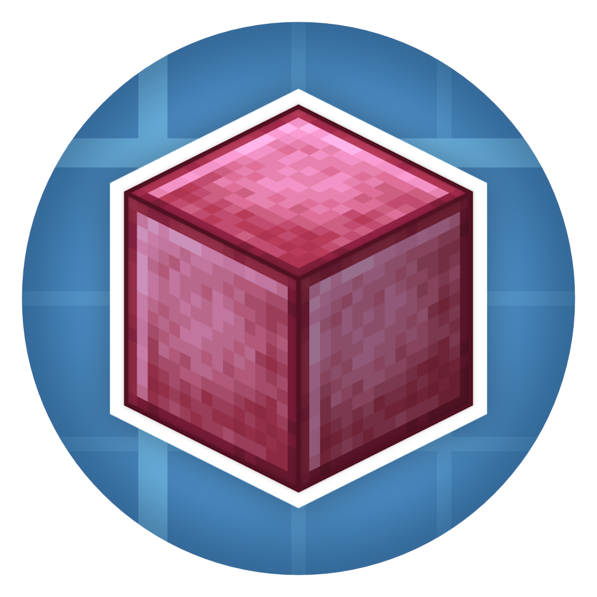

  
  <h1>Pretty In Pink</h1>
	
	
    
    
    

___
## Pretty In Pink is a Create addon that adds many different colors of steel

#### This mod currently adds:
 - 24 different colors of blocks to choose from.
 - 2 different hull options which can be also offset (Same thing Steam 'N Rails does).
 - 5 different types of blocks to choose from ranging from steel blocks to steel tanks.
 - All craftable using zinc ingots in a stonecutter (didn't know what else to do)
___
## License

Pretty In Pink is licensed under the MIT license, checkout [LICENSE](LICENSE) for more information.

Sections of code were used from the Create mod, which is licensed under the MIT license, check out [Create's license](https://github.com/Creators-of-Create/Create/blob/mc1.18/dev/LICENSE) for more information.

Sections of code were used from the Steam 'n Rails mod, which is licensed under the LGPL license, check out [Steam 'N Rails licence](https://github.com/Layers-of-Railways/Railway/blob/1.20/dev/LICENSE) for more information.
